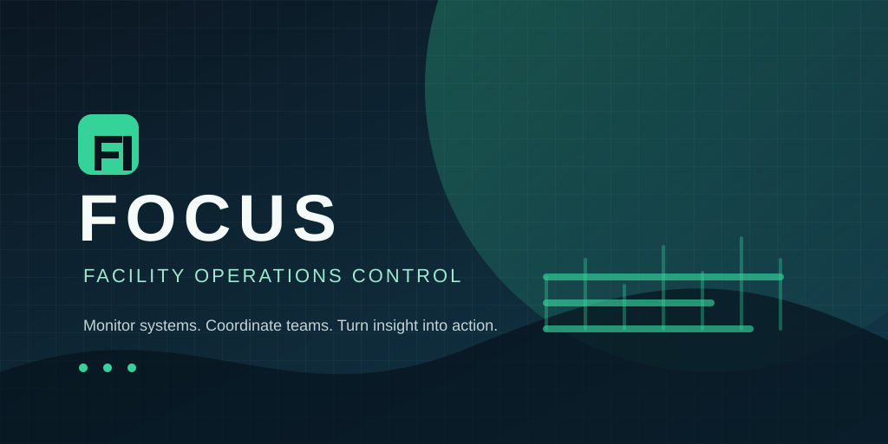

# FOCUS

[](https://github.com/jackysetiawan6/NextJS-FOCUS)
[](https://nextjs.org/)
[](https://www.typescriptlang.org/)



**FOCUS (Facility Operations Control & Utility System)** is an offline-first operations console for data-center facilities. It brings operational monitoring, shift turnover, incident tracking, roster scheduling, electrical readings, and inventory control into one responsive Next.js application.

The repository includes realistic but fictional demo data so the application can be explored without a database or third-party service.

---

## Key Features

### Dashboard

- KPI cards for power, water, permits, incidents, inventory loans, and staff coverage.
- Interactive detail dialogs for operational metrics.
- Power consumption charts for Zone A and Zone B.
- Water usage history and roster-aware staff-on-duty summaries.

### Shift Turnover

- Building Management System alarm and action logs.
- Fire-system isolation and LOTO tag tracking.
- Manual operations records for critical systems.
- Morning, afternoon, and night activity checklists.
- Permit-to-work tracking with status and activity history.
- Incident management with chronological progress updates.

### Electrical Log Sheet

- Electrical readings for PDUs, CRAC units, generators, and UPS systems.
- Date, shift, and text filtering.
- Ten-day zone comparison charts with daily averages.

### Roster Management

- Monthly shift scheduling grid.
- Repeating morning, afternoon, night, and off-day patterns.
- Fictional staff profiles with add/remove workflows.

### Inventory Management

- Asset catalog with quantities, categories, and locations.
- Loan tracking with expected return dates.
- Status management for available, loaned, maintained, and out-of-stock items.

---

## Project Structure

```text
NextJS-FOCUS/
├── public/
│   └── focus-banner.svg          # README banner artwork (1024 × 513)
├── src/
│   ├── app/
│   │   ├── (app)/                # Authenticated application routes
│   │   │   ├── dashboard/
│   │   │   ├── inventory-management/
│   │   │   ├── log-sheet/
│   │   │   ├── roster-management/
│   │   │   └── shift-turnover/
│   │   ├── (auth)/               # Login and password-reset routes
│   │   ├── globals.css           # Global styles and design tokens
│   │   ├── layout.tsx            # Root layout and providers
│   │   └── page.tsx              # Redirects to the dashboard
│   ├── components/
│   │   ├── dashboard/            # Dashboard charts and visualizations
│   │   ├── layout/               # Navigation, sidebar, and profile UI
│   │   ├── log-sheet/            # Electrical log visualizations
│   │   ├── shared/               # Reusable application components
│   │   └── ui/                   # Radix/shadcn-inspired primitives
│   ├── config/                   # Navigation configuration
│   ├── hooks/                    # Shared React hooks
│   ├── lib/
│   │   ├── data/                 # Offline mock data and generators
│   │   └── utils.ts              # Shared utility functions
│   ├── types/                    # Shared TypeScript types
│   ├── utils/                    # Client/server authentication helpers
│   └── middleware.ts             # Route protection middleware
├── next.config.ts
├── package.json
├── tailwind.config.ts
└── tsconfig.json
```

---

## Technology Stack

- **Framework:** Next.js 15 App Router
- **Language:** TypeScript
- **UI:** React, Tailwind CSS, Radix UI primitives, and Lucide icons
- **Charts:** Chart.js with `react-chartjs-2`
- **Dates:** `date-fns`
- **Authentication:** Offline cookie-based demo authentication
- **Deployment configuration:** Firebase App Hosting compatible

---

## Getting Started

### Prerequisites

- Node.js 18 or newer
- npm

### Installation

```bash
git clone https://github.com/jackysetiawan6/NextJS-FOCUS.git
cd NextJS-FOCUS
npm install
```

### Development

```bash
npm run dev
```

Open [http://localhost:9002](http://localhost:9002) in your browser.

### Validation

```bash
npm run typecheck
npm run lint
npm run build
```

No environment variables or external database are required for the included demo.

---

## Authentication

FOCUS uses a local cookie session for offline demonstration. The login and signup flows accept fictional credentials and do not connect to an external identity provider. This implementation is intended for prototyping and should be replaced with production-grade authentication before deployment with real operational data.

---

## Data and Privacy

All records in `src/lib/data` are fictional demo data. Do not add personal, customer, facility, credential, or security-sensitive information to this repository.

---

## Contributing

Contributions are welcome. Please open an issue to describe a bug or proposed feature, then submit a focused pull request with validation results.

---

## License

This project is licensed under the MIT License. See [LICENSE.txt](./LICENSE.txt) for details.
